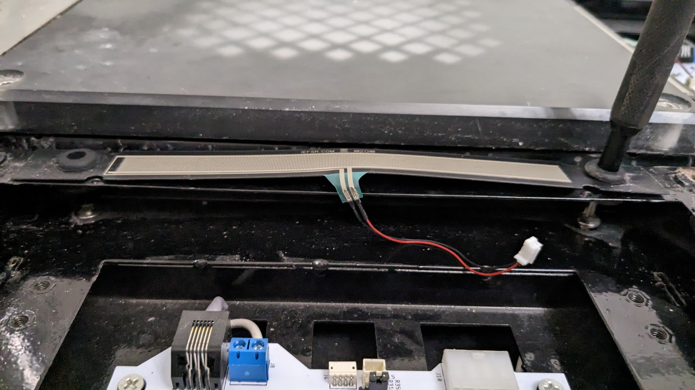

# StepManiaX (SMX) Gen4+ with Arduino Controlled Force Sensitive Resistors 
## Table of Contents
  - [Table of Contents](#table-of-contents)
  - [Introduction](#introduction)
  - [Installation](#installation)
  - [Revert to Stock SMX](#revert-to-stock-smx)
  - [Credits](#credits)

## Introduction
Explicit note: Please perform any modifications to your pad at your own risk. I am not responsible for any damage to any existing hardware if something happens to go wrong.
This guide is meant to be supplementary material to the existing guide [teejusb/fsr](https://github.com/teejusb/fsr). 
For setting up an Arduino/Teensy board to work with the SMX FSRs, please follow that guide and the ones also listed within it. The concept is the same, and I used jumper cables to bridge the connection to the stock FSRs as seen in the [Installation](#installation) section.

This implementation is meant to preserve as much of the base hardware as possible in the SMX pad to ensure it can be converted back to be played with the orignal SMX software. The only component removed from the pad is the power switch box at the front of the pad where the power cable is connected so that the new wires that go to the FSRs can go into it externally as this particular implementation houses the Arduino outside of the pad. This guide will go into more detail about suggestions on better ways to house the Arduino and wires in the [Installation](#installation) section.

## Installation
Setting up FSRs for gameplay with an app to adjust the sensitivities happens in three parts.
1. [Setup the Arduino and breadboard using teejusb's guide.](https://github.com/teejusb/fsr) The only difference between the Arduino implemenation for normal style DDR/ITG pads and SMX pads as far as sensors go is the ability to use the existing SMX FSRs without needing to remove them from the pads like you would traditional sensors in a normal style pad. You can see an example of how jumper cables can be wired into the existing SMX FSR molex connector below:

    

Suggestion/Recommendation: You can either solder the far end of the jumper cabels to the longer wire that will be routed throughout the pad, or do as I did and string multiple jumper cables together and tie them together with electrical tape (not ideal but it works). See below for example images for my Arduino/BreadBoard setup:

    
      

2. Remove the power switch box from the front of the pad so you can route the cables into it. To access below the SMX frame that holds the PCB that the FSRs plug into, you can find two sets of screws on the Left and Right channels that you can remove to lift the frame up and work the wires through the open areas into the individual arrow panels.

    
    

   

Those wires can be brought up from the underside into the main PCB area to connect to the SMX FSR.

    

 
   
3.Put the Arduino into an external housing/route cables to housing.

My implementation is far from ideal in this case. I put my Arduino and breadboard into a shoebox and have that directly in front of the pad because I used slightly too few jumper cables and didn't have enough length to fit the shoebox next to my PC. My suggestion would be to get some tubing to act as a wire shield and route that to the Arduino and breadboard. I also suggest better housing than a shoebox for this long term. Regardless, this is what my current implementation looks like fully put together:

    

 

## Revert to Stock SMX
All that is required in order to switch back to using the pad for normal SMX game use is the following:
1. Unplug the wires from the breadboard (unplug the closet set of jumper cables to the pad) and tuck the remaining wires into the front panel. 
2. Hook back up the power switch box so you can power the pad on via the normal power supply. 
3. Remove the panels and unplug the jumper cables from each of the FSRs. 
4. Plug the FSRs back into the SMX PCB

That's it! The conversion process back for SMX use is complete. Outside of having to remove the power switch box it's a fairly seemless process to go back-and-forth.

## Credits
- Thank you [teejusb](https://github.com/teejusb) and [VincentITG](https://github.com/vlnguyen)! Between Vincent's easy to follow picture guide and instructions from both guides, I was able to successfully implement the Arduino FSR method with my SMX Gen 4 pad. 
- [teejusb/fsr](https://github.com/teejusb/fsr)  [vlnguyen/itg-fsr](https://github.com/vlnguyen/itg-fsr)
- Please refer to these guides for setting up Arduino/Teensy board connections for general FSR use. The concept for the SMX pad is almost exactly the same.

